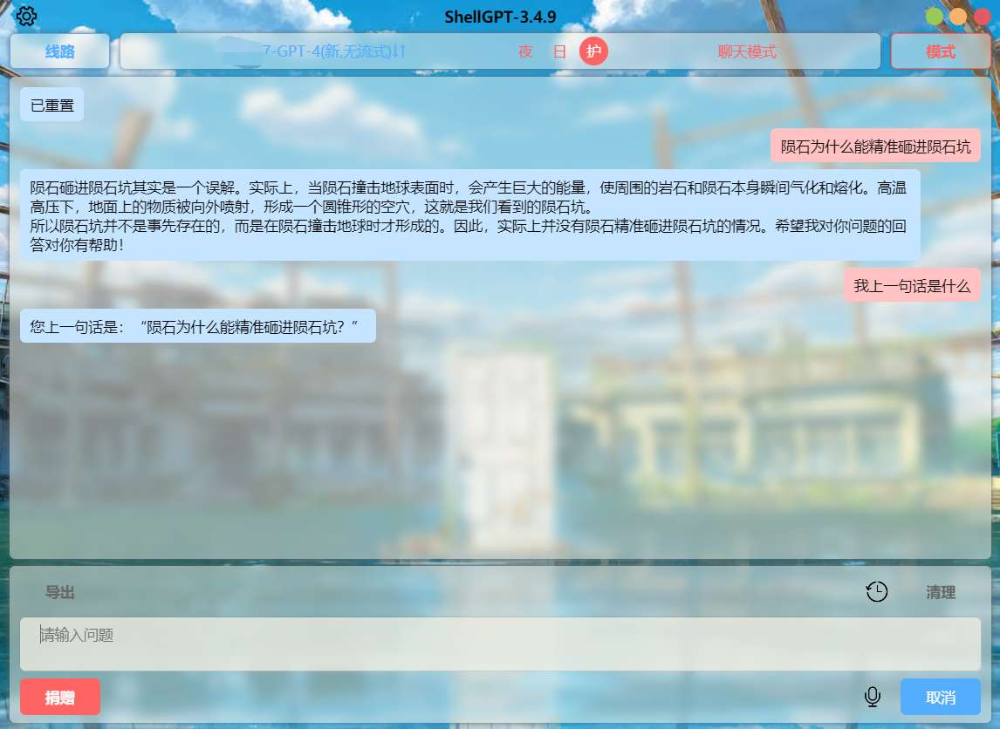
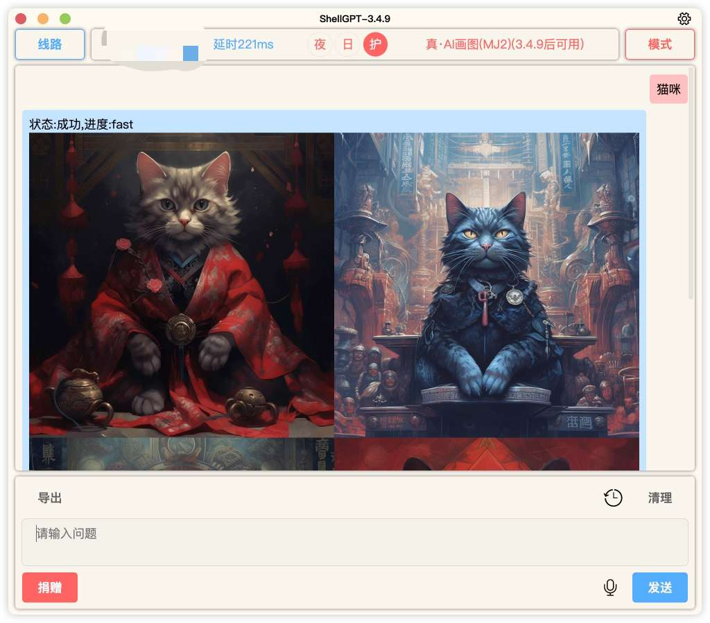
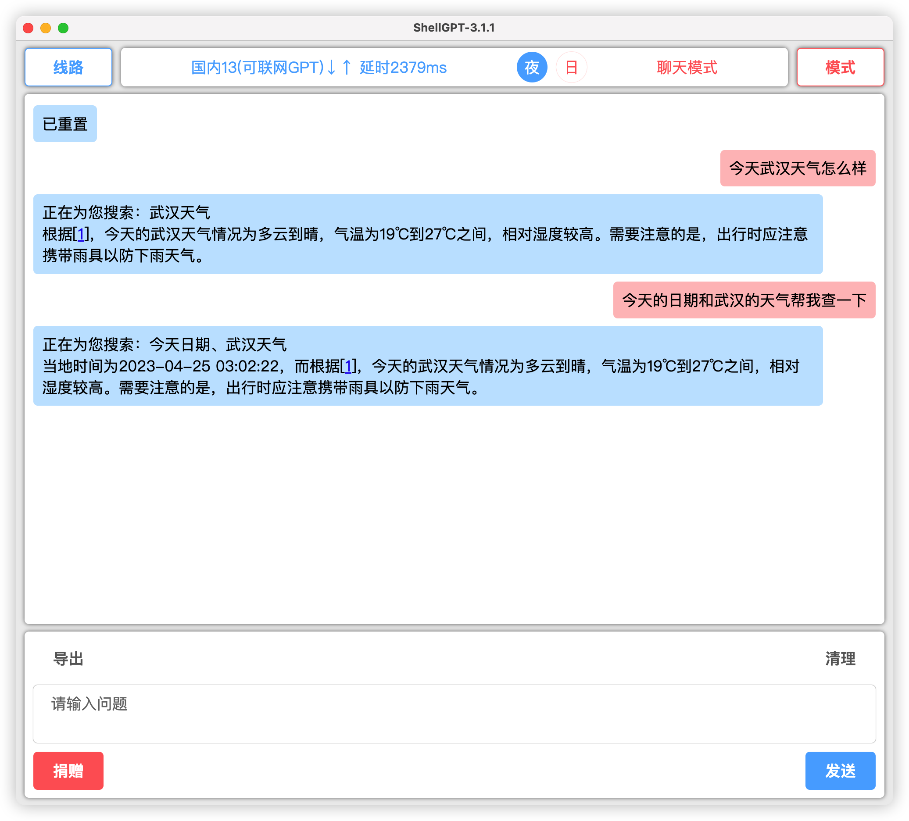
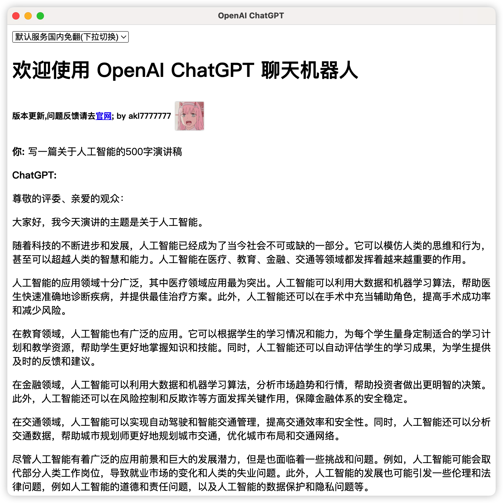
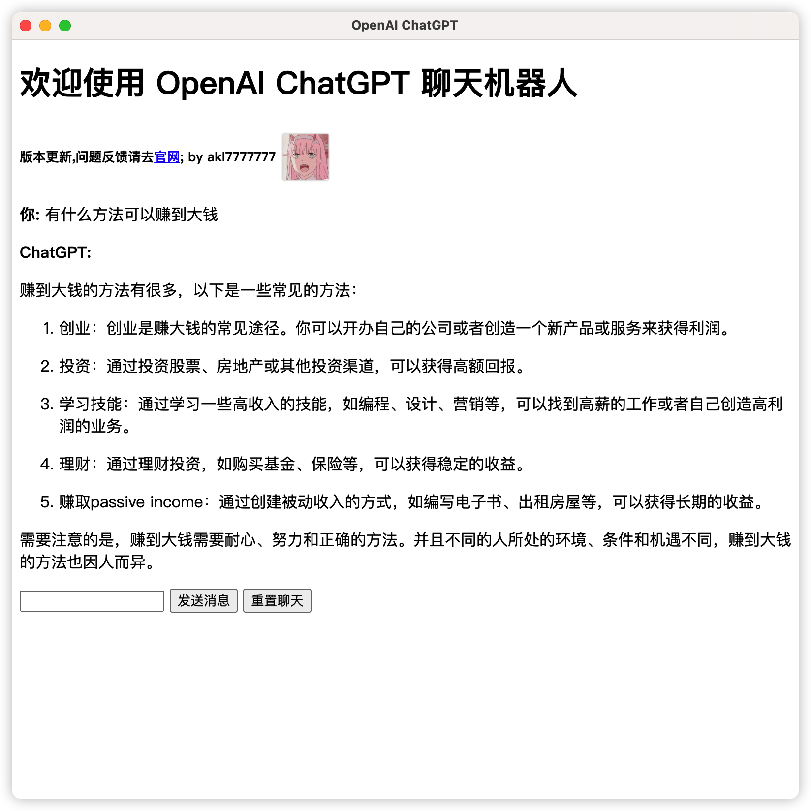
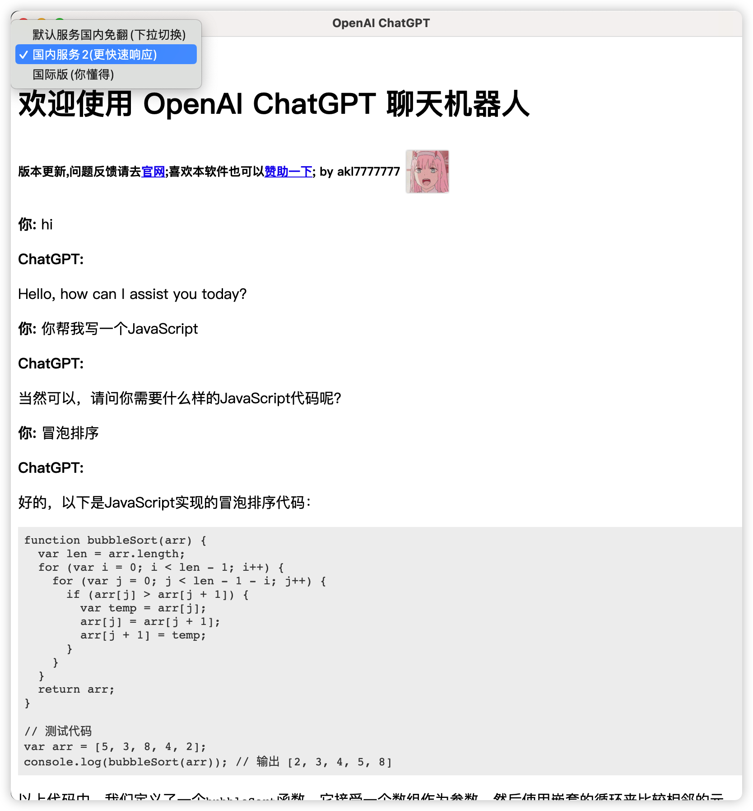
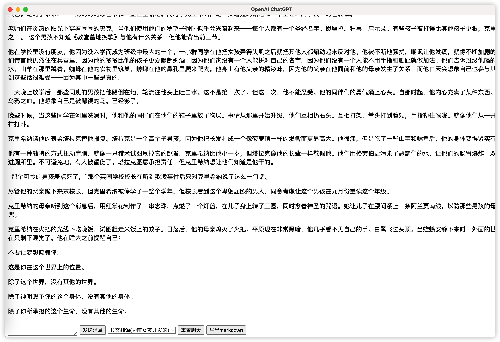

<div align="center">

<h1 align="center">ShellGPT (壳聊/芍聊)</h1>

 一款基于**ChatGPT|NewBing|Claude|AI**绘图等开发的的应用端

🌈**完全免费**  **支持多平台**

[立刻下载](https://github.com/akl7777777/ShellGPT/releases)

[百度网盘下载](https://pan.baidu.com/s/12j-QIQ4uAlwkhwIDzgXaeQ?pwd=7777)

[在线使用-1](https://chat.shellgpt.top/#/) / [在线使用-2](http://chat.shellgpt.link/#/) / [官方网站](http://frp-fly.top:27910/) 

[QQ群](http://qm.qq.com/cgi-bin/qm/qr?_wv=1027&k=FIKm6ir8IHZ_eIMGdsGV9U7YLPJGkavG&authKey=B%2BmZt3%2F7ecn3VTWIP%2BkNmPYjE8zgIyup9ZKYt8OhNMaRUS7a%2B2DvOgCaQDwlyCJS&noverify=0&group_code=588972515) / [电报群](https://t.me/+PpI3ZaVgwNk0MDg1) / [插件开发](https://youtu.be/CbJZPAFccA0) / [赞赏开发者](https://afdian.net/a/akl7777777)

[![Windows][Windows-image]][download-url]
[![MacOS][MacOS-image]][download-url]
[![Web][phone-image]][phone]

[![Web][guan-image]][guan]
[![Web][Web-image]][web-url]
[![Web][Web-image]][web-urll]


</div>

[web-url]: ttps://chat.shellgpt.top/#/
[web-urll]: http://chat.shellgpt.link/#/
[download-url]: https://github.com/akl7777777/ShellGPT/releases
[Web-image]: https://img.shields.io/badge/Web-PWA-orange?logo=microsoftedge
[Windows-image]: https://img.shields.io/badge/-Windows-blue?logo=windows
[MacOS-image]: https://img.shields.io/badge/-MacOS-black?logo=apple
[phone-image]: https://img.shields.io/badge/ShellGPT-Mobile-blue
[guan-image]: https://img.shields.io/badge/Visit_official_website-green
[phone]: https://github.com/akl7777777/ShellGPTMobile/releases
[guan]: http://frp-fly.top:27910/


```
|📢NEWS
上新国内免翻NewBing(新必应)线路，支持GPT联网搜索,AI Drawing 
网页端新增支持Claude+|GPT4|超长对话
```

```
|🚀UPDATE V3.X.X
·全新的UI界面
·优化检测更新模块,支持静默检测,防止弹窗打扰
·优化节点自动选择方式
·新增插件系统,可以自己写插件,插入即可新增节点
·优化国际版,官方版的页面跟随窗口大小自适应
```

## 目录

[toc]

## 总体介绍

<div align="center">

#### 😍中国能免费使用的ChatGPT|GPT4|NewBing|Claude😍

</div>

**🤖ChatGPT、🚀GPT4、🌐NewBing、📚Claude**是一系列**基于人工智能技术的💬语音对话、📝文本生成、语言理解的大模型**.它们可以帮助用户实现**快速、准确、智能的交互体验**，满足各种场景下的需求。 无论是**日常聊天、📊学术研究、商业应用，还是创意创新**，**ChatGPT、GPT4、Claude、NewBing都是您不可或缺的智能助手**。

## 功能点

- ✨支持GPT3.5|GPT4|GPT联网搜索
- 💬支持对话上下文
- 🎨支持图生图、根据文档聊天、NewBing、AI绘图
- 💾支持聊天记录保存以及切换
- 🔄支持多节点测速自动切换;
- 🌍支持国内免翻版和国际版的切换;
- 💻支持多平台，Windows，MacOS，Linux，Android;
- 💬支持 对话模式 翻译模式 长文翻译(不限制字数) 文字润色 四种模式切换;
- 🔑支持官方API自行填写密钥[反向代理]
- 📦支持插件系统
- 🔍聊天记录查询、切换

## 将要实现

- [x] 💻重构UI：感谢群内热心的“白板”兄弟爆肝写界面，真的非常感谢🎉！
- [ ] 🎙️语音识别：通过软件内录音按钮进行录音并转文字
## 💻MacOS问题解决

#### 一. 🚨MacOS打不开ShellGPT

1. 打开**启动台**，选择**终端**，输入：`sudo spctl  --master-disable`

2. 然后回车，继续输入密码`注：密码输入时是不可见的`，回车

#### 二. 🚨MacOS 打开软件出现 `'xxx' 将对您的电脑造成伤害。您应该将它移到废纸篓`

> ###### 💡方案一

1. 访达 -> 应用程序 xxx.App -> 右键 -> 显示简介 

勾选 “覆盖恶意软件保护”。


> ###### 💡方案二

请尝试使用以下的命令方式

`codesign --force --deep --sign - /Applications/OpenAi-ChatGPT.app`


## 赞赏开发者

#### 开发不易,如果喜欢可以请作者喝一杯可乐,谢谢!

### [**爱发电**](https://afdian.net/a/akl7777777)

### 

## ShellGPT图鉴
> **V3.x** **新版**
<div align="center">

[1](./images/图鉴1.png)

> **旧版怀旧**
[1](./images/旧1.png)    >

</div>
